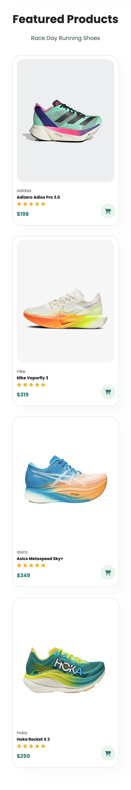

# Responsive E-commerce Website

This project is to practice my HTML, CSS and Javascript (just to show the menu bar) skills on just the Main Page.

---

### On a normal screen size (laptops or monitors)

In this project, I've set global styling for certain elements and use certain styles such as the hover effect, active, position, background-image, display flex and it's flex properties, and the responsive media screen for 2 different screen sizes (799px and 477px).

---

### On max-width 799px media screen

In this media screen, I've adjusted a few stylings and also added a menu bar instead of showing the whole navbar list. This is where the Javascript comes into play by using the addEventListener to either add or remove classList.

---

### On max-width 477px media screen

This is just for the smaller screen such as phones.
